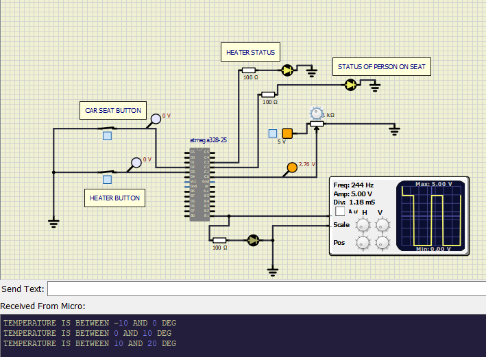

# Embedded_259036
## Car seat heat control
*   In the places where snow falls or temperature is less,that is around zero degree centigrade, people feel comfort if the car seats are warm while travelling.

*   In this project Microcontroller ATMega 328 is used to control seat temperature.

*   program is designed like Heater starts operation only if person is sitting on seat and heater switch is closed.

*   When both above conditions are true Temperature sensor starts sensing tempraure of seat.
*   If seat temperature is more than 25 deg centigrade,there will be no supply to heater because seat is warm enough.
*   If temperature is less than 25 deg PWM output drives the heater driver circuit.
*   PWM output and temperature values are inversely proportional i,e lesser the temperature more value of PWM signal will drive the heater.
*   for different range of temperature values different PWM value signal is generated.
*   when temperature rises above 25 deg,PWM signal will be 0(low).
*   All this opeartion is automatic and also temperature range is transmitted to serial output.

