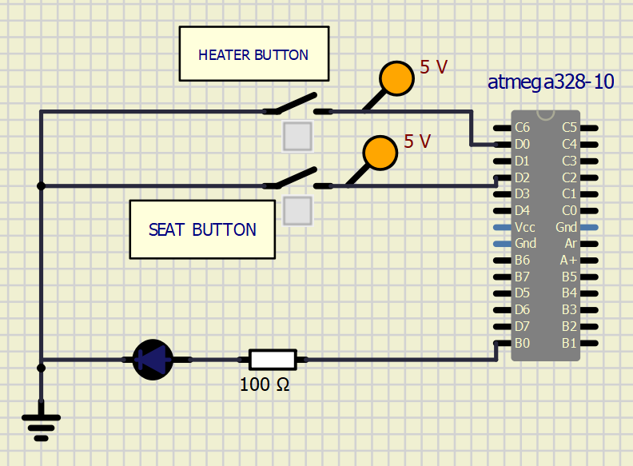
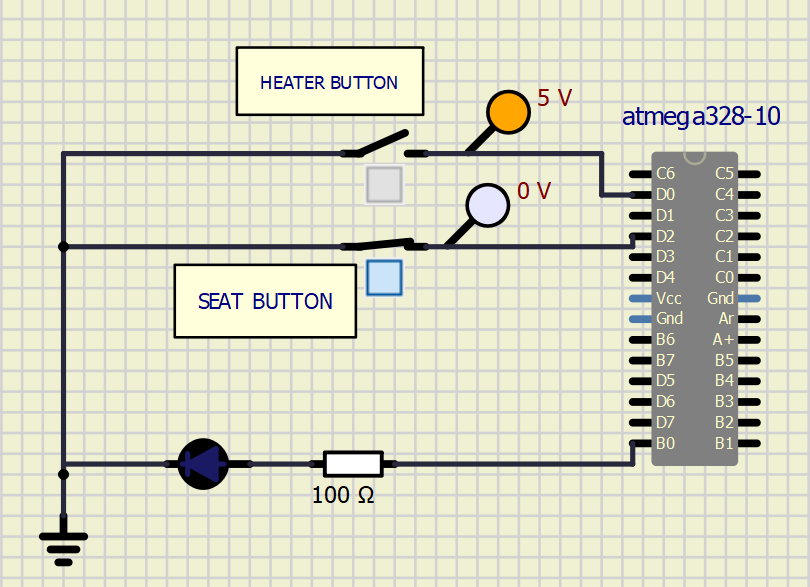
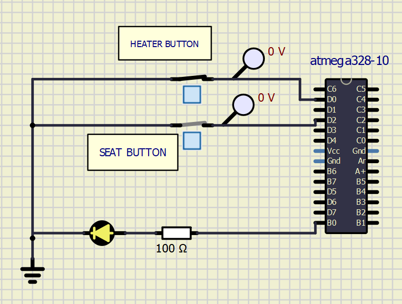

# Car Heater control
* consists of two switches or buttons.
* One LED which shows the status of Heater.

|LED |Heater status|
|:--:|:--:|
|Glow|ON|
|Not Glow|OFF|

## simulIDE
### photos

* when both switches are open LED is not glowing.
 

* When only person is sitting but heater button is not closed LED still remain not glown.

* when both switches are closed LED will glow

