# Car seat Heater control
*   consists of two switches or buttons.
*   switch (PD2) for seat.

| switch (PD2)status | meaning |
|:----:|:----:|
|close|person is sitting|
|open|person is not sitting|

*   another switch (PD3) is used to turn on heater which consists of Temperature sensor.
*   LED connected to PC2,shows the visual status of seat switch.

## simul IDE
### photos

*   when  switches are open LED is not glowing.
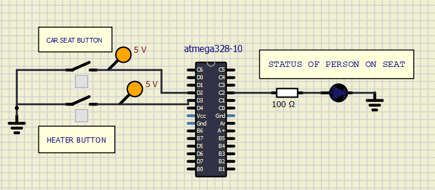 

*   When only person is sitting but heater button is not closed LED(PC2) is glowing

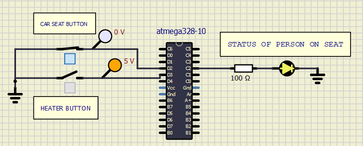

## Activity 2

*   In activity 2 one LED (PC3) and one Potentiometer are added.
*   LED to indicate whether heater is ON or not.
*   POT acts as variable temperature.
*   LED connected to PC3 shows Heater is on or not.

|LED (PC3)|Heater status|
|:--:|:--:|
|Glow|ON|
|Not Glow|OFF|

*   After switch PD3 is closed Temp senser(POT) starts sensing temperature.
*   If temperature is less than 25 degree,then LED (PC3) will glow indicates supply to heater is ON.

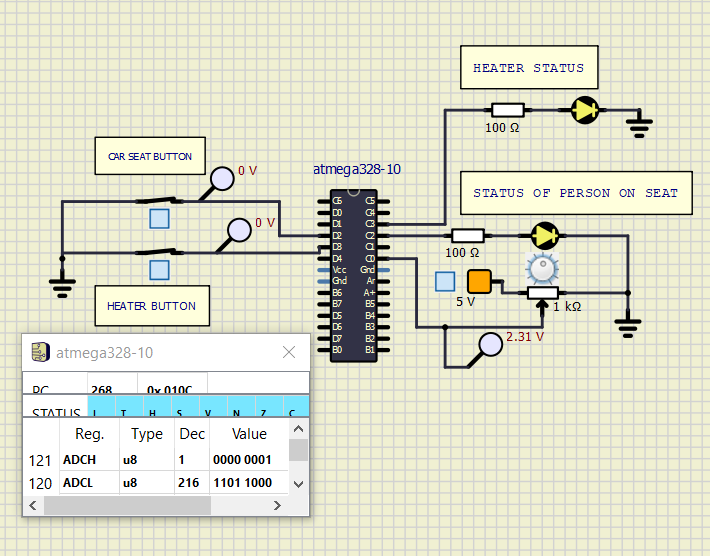 
*   If or when temp is more than 25 degree,then LED(PC3) stops glowing indicates no supply to heater.below picture of simulation shows the same.

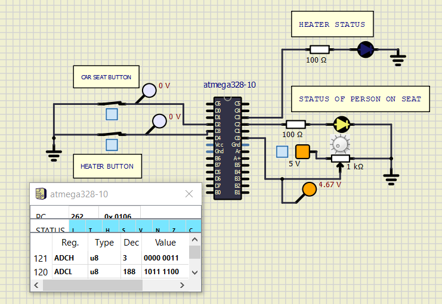 

*   POT output is analog value in order to read that ADC initialisation is done in program.

## Activity3

*   in activity 3 different PWM signals are generated for different temperature value measured by temp sensor.

|Temp range in deg |PWM value|
|:---:|:--:|
|-10 to 0| 4.5 volts|
|0 to 10|   3.5 volts|
|10 to 20|  2 volts|
|20 to 25|  1 volts|
| > 25| 0 volts|

*   low temperature value -10 to 0 deg,for that range more power is supplied to generate more heat.

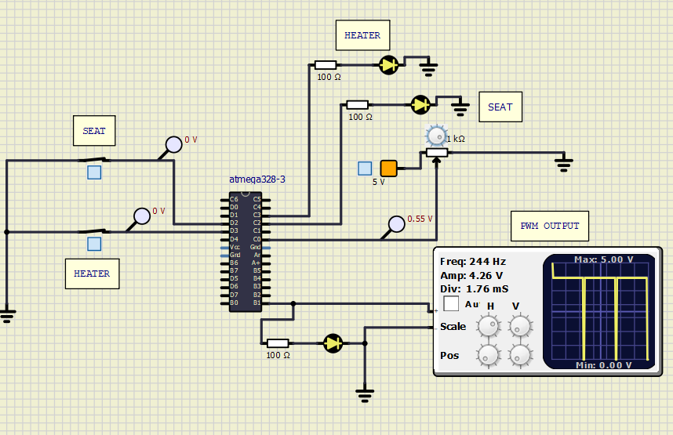
*   as temperature reaches 20 to 25 deg,low power is supplied.

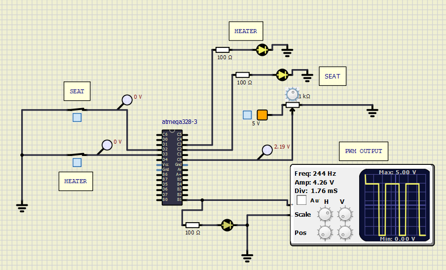
*   if temperature is more than 25 deg no power is supplied.

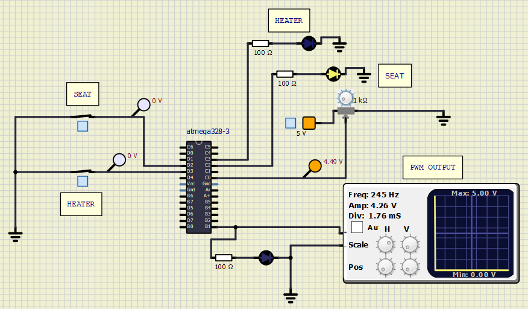

## Activity4

*   In Activity4 Temperature data is displayed in serial port.
*   Serial port registers are configured.
*   Baudrate is calculated and assigned.
*   For particular temperature a message of temperature is sent.

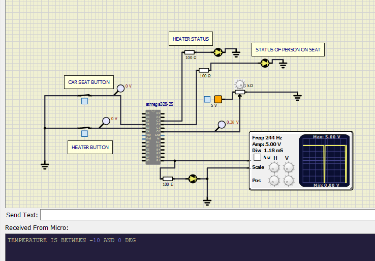

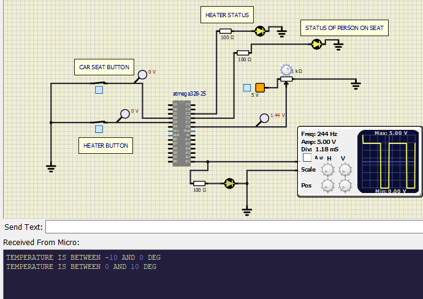

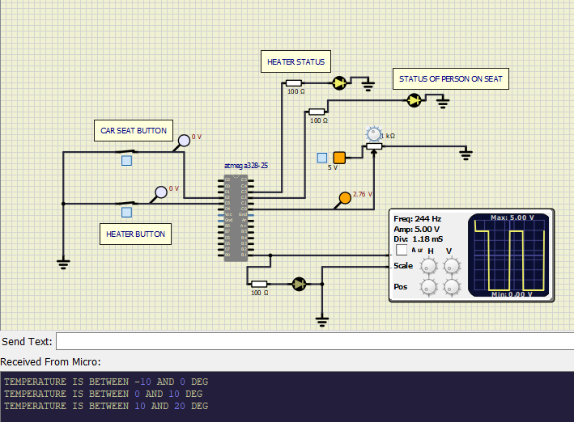

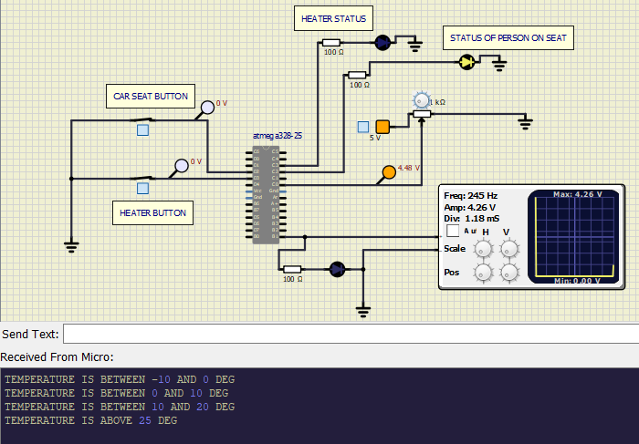
